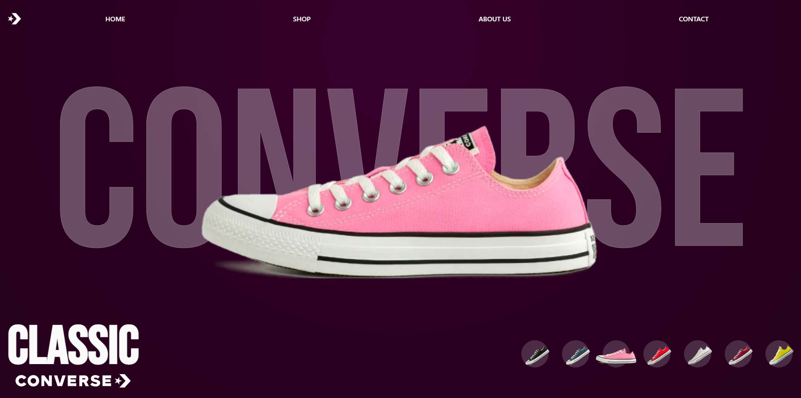

# Converse Slider 🎨👟

Um slider interativo de tênis Converse, onde você pode explorar diferentes modelos e cores. Desenvolvido com React, Framer Motion e Tailwind CSS, o projeto oferece transições suaves e animações fluidas para uma experiência de usuário incrível.

## 🚀 Live Preview

Confira o projeto em funcionamento: [Live Preview](https://slider-converse.vercel.app/)

## 🛠️ Tecnologias Utilizadas

- **React**: Para a estrutura do projeto.
- **Framer Motion**: Para animações suaves e interativas.
- **Tailwind CSS**: Para estilização rápida e responsiva.
- **Vite**: Para um ambiente de desenvolvimento rápido e eficiente.
